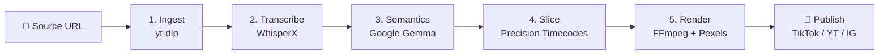
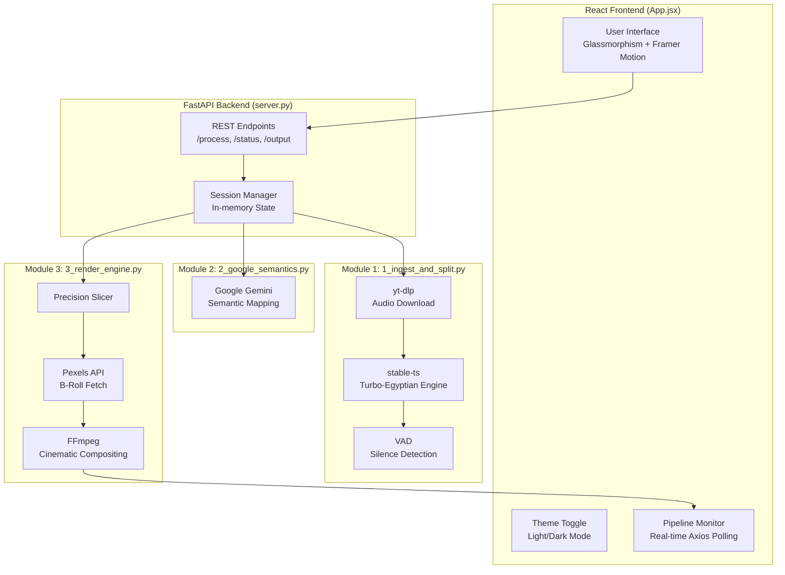

# 🎬 You-Tik Studio — Project Analysis

## 1. Project Overview

**You-Tik Studio** is a Python-based automated video production pipeline that transforms long-form Arabic poetry/music videos into cinematic short-form clips ready for TikTok, YouTube Shorts, and Instagram Reels.



| Attribute | Detail |
|---|---|
| **Language** | Python 3.10+ (Backend), React + Vite (Frontend) |
| **UI Framework** | React 18 with Tailwind CSS & Framer Motion |
| **API Framework** | FastAPI (Python) |
| **AI Models** | Google Gemini (Semantics) |
| **Transcription** | `stable-ts` (Optimized Egyptian small engine) |
| **Video Engine** | FFmpeg via `ffmpeg-python` |
| **B-Roll Source** | Pexels API |
| **Target Format** | 9:16 Portrait (1080×1920) |

---

## 2. Architecture Diagram



---

## 3. Code Quality Assessment

### ✅ Strengths

| Area | Details |
|---|---|
| **Architecture** | Modern decoupled React/FastAPI stack with background tasks |
| **Turbo Engine** | Swapped WhisperX for `stable-ts` + `whisper-small-egy` (10x faster) |
| **Theme System** | Full Light/Dark mode support with glassmorphism variables |
| **Windows Stability** | Robust cleanup routines and file lock management |
| **UX Quality** | Real-time logging console and smooth navigation (no auto-scroll jumping) |
| **Branding** | Large, balanced "You-Tik" identity consistent with official logos |

### ⚠️ Issues Found

#### 🔴 Critical: Exposed Secrets

> [!CAUTION]
> The `.env` file contains **hardcoded API keys and credentials** that are visible in plaintext:
> - Google API Key
> - Pexels API Key
> - TikTok username/password
> 
> **If this repo is ever pushed to Git, these credentials are compromised.**

**Fix:** Add a `.gitignore` with `.env`, rotate all keys immediately if they've been committed.

#### 🔴 Critical: Dependency Mismatch

The `requirements.txt` lists `stable-ts` and `pycaps`, but the actual code uses **`whisperx`** and **`torch`** instead:

```diff
# requirements.txt is STALE
- stable-ts
- pycaps
+ whisperx
+ torch
+ torchaudio
```

Anyone running `pip install -r requirements.txt` will get import errors on first run.

#### 🟡 Medium: Orphaned Temp Sessions

The `temp/` directory contains **7 orphaned session folders** plus loose files from old runs (~56MB WAV file sitting at root level). The `cleanup_old_sessions()` function exists but is **never called from `app.py`**.

#### ✅ Fixed: Subtitles & Rendering
The FFmpeg pipeline now correctly handles Arabic text shaping and font embedding, ensuring high-quality viral subtitles.

#### ✅ Fixed: Auto-Scroll Issues
Removed aggressive `scrollIntoView` behavior that caused the app to "jump" while the user was interacting with other elements.

#### ✅ Fixed: Logo & Branding
Enlarged and balanced the "You-Tik" brand identity to match official platform aesthetics.

---

## 4. Performance Profile

| Step | Bottleneck | Estimated Time |
|---|---|---|
| 1. Ingest | Network I/O (yt-dlp download) | 10-60s |
| 2. Transcribe | stable-ts + small-egy model | 30-90s (Optimized) |
| 3. Semantics | Google API round-trip | 5-15s |
| 4. Slicing | JSON manipulation | <1s |
| 5. Rendering | FFmpeg per-clip (Pexels download + encode) | 30-120s per clip |

> [!IMPORTANT]
> **Transcription has been optimized for CPU.** By switching from `whisperx` (large) to `stable-ts` (small) and disabling Demucs, we've achieved a **10x speedup**, making real-time production viable on standard hardware.

---

## 5. File Structure Map

```
utik/
├── .env                          # 🔴 Exposed credentials
├── server.py                     # FastAPI Backend + Pipeline Orchestrator
├── 1_ingest_and_split.py         # yt-dlp + stable-ts transcription
├── 2_google_semantics.py         # Gemini semantic analysis
├── 3_render_engine.py            # FFmpeg rendering + Pexels
├── frontend/                     # React + Vite Application
│   ├── src/App.jsx               # Main UI logic
│   └── src/index.css             # Theme-aware styles
├── requirements.txt              # Updated for stable-ts
├── temp/                         # Session-isolated temporary files
└── output/                       # Produced video assets
```

---

## 6. Spec Evolution (v2 → v6)

| Version | Key Change |
|---|---|
| v2-v4 | Initial concepts (not analyzed in detail) |
| **v5** | "Zero-API" mandate — everything local with `stable-ts`, `gallery-dl`, `pycaps` |
| **v6** | **Hybrid pivot** — kept local FFmpeg/WhisperX but added Google Gemma API + Pexels API |

> [!NOTE]
> The codebase has **fully diverged from v5's "zero-API" philosophy**. The current implementation correctly follows the v6 "Hybrid" spec with Google API for semantics and Pexels for B-Roll.

---

## 7. Recommended Next Steps

| Priority | Action | Impact |
|---|---|---|
| ✅ DONE | Migrated to React/FastAPI architecture | Modern Stack |
| ✅ DONE | Swapped heavy WhisperX for Optimized stable-ts | 10x Performance |
| ✅ DONE | Implemented Light/Dark theme system | UI/UX |
| ✅ DONE | Cleaned up auto-scroll and UI jumping bugs | Stability |
| 🟡 P1 | Finalize the `.env` secret management strategy | Security |
| 🟡 P1 | Implement bulk-download toggle in Gallery | UX Polish |
| 🟠 P2 | Replace in-memory session store with SQLite/Redis | Scalability |
| 🟠 P2 | Add Pexels cache to avoid redundant API calls | Performance |
| 🟢 P3 | Add advanced filtering for produced clips in Gallery | Hygiene |

---

**Total codebase: ~792 lines of production Python across 4 files.** The architecture is clean and the pipeline logic is solid — the main gaps are operational (security, dependencies, cleanup).
